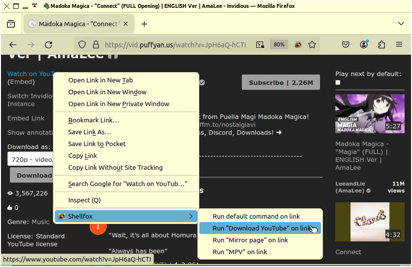

#  Shellfox

[Shellfox](https://hak.xwx.moe/jadedctrl/shellfox) is a simple add-on for [Firefox](https://firefox.com) that allows you to run shell commands at the click of a button.

<a alt="Screenshot of Shellfox." href="res/screenshot-youtube.png"></a>


## Installation
Shellfox uses a native program in order to run commands; installing only the add-on isn’t enough. Currently, the native program has only been tested on GNU/Linux, though it is likely to work on BSDs, and potentially macOS.

First, download the repository: [shellfox.zip](https://hak.xwx.moe/jadedctrl/shellfox/archive/master.zip)

Then, in the repository’s directory, open a terminal and run:

```
$ sudo make native-install
```

After that, you can install the add-on; then, voilà!


## Related projects
This add-on was inspired by [Textern](https://github.com/jlebon/textern/), which allows you to edit text-boxes with an external editor like [Emacs](https://gnu.org/software/emacs). It’s very useful, I highly recommend it!

## Source code
https://hak.xwx.moe/jadedctrl/shellfox  
Author is Jaidyn Ann, <jadedctrl@posteo.at>  
License is the [GNU GPLv3](LICENSE).
