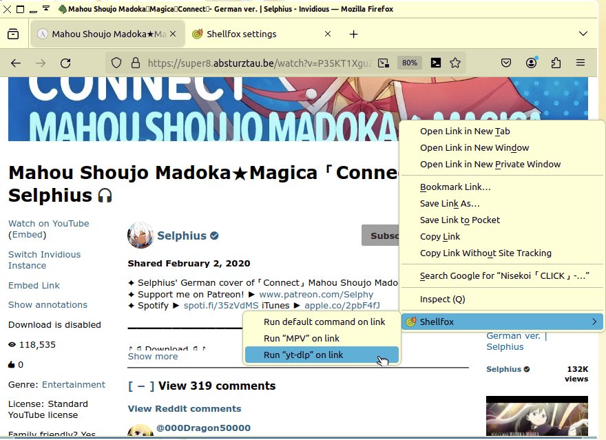

#  Shellfox

[Shellfox](https://hak.xwx.moe/jadedctrl/shellfox) is a simple add-on for [Firefox](https://firefox.com) that allows you to run shell commands at the click of a button.




## Installation
Shellfox has two components: A Firefox extension, and a native script that the extension uses to run commands.

You can install the Firefox extension from [Firefox Add-ons (AMO)](https://addons.mozilla.org/en-US/firefox/addon/shellfox).

The native script has only been tested on GNU/Linux, though it is likely to work on BSDs, and potentially macOS. It can be installed like so:

1. Download the repository: [master.zip](https://hak.xwx.moe/jadedctrl/shellfox/archive/master.zip)
2. Extract the ZIP-archive; this will make a folder called `shellfox/`.
3. Open a terminal within that `shellfox/` folder.
4. Run the command: `$ sudo make native-install`
5. Make sure you have [the Firefox extension](https://addons.mozilla.org/en-US/firefox/addon/shellfox) installed.
6. Profit! ^_^


### From terminal
To install the native script solely from a terminal:

```
$ curl https://hak.xwx.moe/jadedctrl/shellfox/archive/master.tar.gz | tar -xzv
$ cd shellfox/
$ sudo make native-install
```


## Related projects
This add-on was inspired by [Textern](https://github.com/jlebon/textern/), which allows you to edit text-boxes with an external editor like [Emacs](https://gnu.org/software/emacs). It’s very useful, I highly recommend it!


## Source code
https://hak.xwx.moe/jadedctrl/shellfox  
Author is Jaidyn Ann, <jadedctrl@posteo.at>  
License is the [GNU GPLv3](LICENSE).
